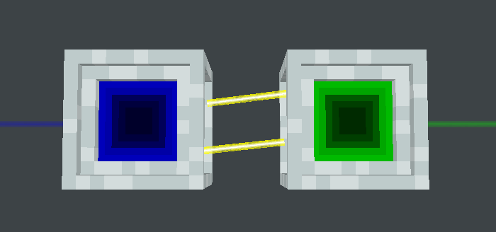

---
navigation:
  title: "Energy Card Subnets"
  parent: laserio:advanced/advanced.md
---

# Energy Card Subnets

[Energy Cards](../cards/card_energy.md) are capable of “subnetting”. That is, two separate [Node](../blocks/laser_node.md) networks can transfer energy between each other. This is done by:
1. Placing two [Nodes](../blocks/laser_node.md) beside each other 
2. Use an inserting [Energy Card](../cards/card_energy.md) which pushes energy from the main network. 
3. Use an extracting [Energy Card](../cards/card_energy.md) in the subnetwork which receives energy.

*The blue network pushes energy into the green network*

#### *Why would I do this?*

Large networks are laggy. However, large networks that have only energy cards are **not** laggy. It is ideal to have one massive energy node network, then push that into networks which require other types of [Cards](../cards/cards.md).

[Redstone Cards](../cards/card_redstone.md) can also have subnets for more complex redstone operations.
